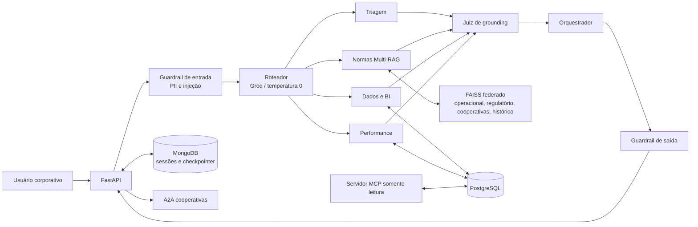

# VOLTA API

Backend SaaS B2B para gestão operacional, rastreabilidade de resíduos industriais e compliance ESG/ODS 12. O sistema foi estruturado para atender à rubrica da disciplina: FastAPI, LangChain, LangGraph, mais de cinco agentes, MongoDB por sessão, PostgreSQL transacional, RAG federado, guardrails, agente juiz, MCP/A2A e SRE.

## Arquitetura



## Regras de segurança adotadas

- O texto é anonimizado antes de entrar no LangGraph, MongoDB, RAG ou modelo.
- O LLM não recebe ferramenta de escrita no PostgreSQL.
- A triagem entrega somente uma proposta. O registro final depende de `POST /v1/occurrences/drafts/{id}/approve`, chamado por um responsável humano.
- O agente juiz reprova alegações sem evidência recuperada ou dado de banco.
- Os índices FAISS mantêm contextos operacionais, regulatórios, cooperativas e histórico separados.

## Execução local

1. Copie `.env.example` para `.env` e preencha ao menos `GEMINI_API_KEY`. Opcionalmente configure a chave Groq para o roteador.
2. Inicie as dependências: `docker compose up -d postgres mongo mongo-init`.
3. Instale as dependências: `python -m pip install -r requirements.txt`.
4. Inicie a API: `uvicorn app.main:app --reload`.
5. Acesse `http://127.0.0.1:8000/docs`.

O MongoDB do `docker-compose` usa replica set porque `MongoDBSaver` do LangGraph precisa de persistência compatível com checkpoints.

## Primeira fonte externa e RAG

Após iniciar a API, faça uma única ingestão autenticada de fonte oficial do ODS 12:

```bash
curl -X POST http://127.0.0.1:8000/v1/rag/external-source \
  -H "content-type: application/json" \
  -H "x-admin-key: troque-por-uma-chave-longa" \
  -d '{"corpus":"regulatory","title":"ONU - Objetivo 12","url":"https://sdgs.un.org/goals/goal12"}'
```

Documentos internos, FISPQs e contratos devem ser inseridos nos corpus corretos por um processo autenticado de ingestão antes do uso em produção.

## Endpoints relevantes

- `POST /v1/sessions`: cria sessão isolada por tenant e usuário.
- `POST /v1/chat`: executa o LangGraph e devolve resposta, fontes, proposta de ocorrência e parecer do juiz.
- `POST /v1/occurrences/drafts`: persiste um rascunho já revisado pelo usuário.
- `POST /v1/occurrences/drafts/{draft_id}/approve`: única etapa que registra a ocorrência definitiva.
- `POST /v1/integrations/cooperatives/collection-request`: integração A2A com assinatura HMAC.
- `GET /metrics`: métricas Prometheus.
- `GET /v1/observability/weekly-estimate?active_users=100`: custo, latência, taxa de erro e custo por resolução para a defesa.
- `python -m app.mcp_server`: expõe uma tool MCP somente leitura para métricas ESG.

## Teste inicial

```bash
pytest -q
```

Antes da demonstração, execute testes de rota direta, tentativa de prompt injection, PII no histórico, ausência de evidência RAG, rejeição pelo juiz e aprovação humana da ocorrência.
